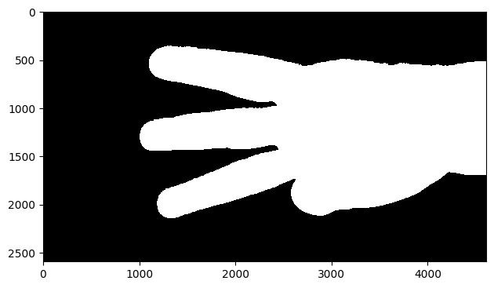

# Hand gesture recognition in Python

[](https://www.python.org/downloads/release/python-385/)
[](https://opensource.org/licenses/MIT)

## Hand Gesture Recognition Project Summary

The hand gesture recognition project aims to develop a system that can recognize hand gestures from images. The project utilizes the Histogram of Oriented Gradients (HOG) feature extraction technique and employs preprocessing with segmentation for better recognition accuracy.

### Project Workflow:

1. **Preprocessing**: We perform segmentation based on skin color after converting the color space into YCrCb so that the segmentation is robust to illumination.

2. **Feature Extraction**: Utilize the HOG feature extraction method to extract relevant features from the segmented hand region. HOG calculates and represents the local gradient orientations in the image, capturing shape and texture information.

3. **Model selection and Training**: Select the best model that fits the data and tune its paramaters using gridsearch technique and k-fold cross validation.

4. **Testing and Evaluation**: Evaluate the trained model on the testing set to assess its performance. Measure metrics such as accuracy, and time required for the image to be preprocessed and classified.


## Table of Contents

- [Hand gesture recognition in Python](#hand-gesture-recognition-in-python)
  - [Hand Gesture Recognition Project Summary](#hand-gesture-recognition-project-summary)
    - [Project Workflow:](#project-workflow)
  - [Table of Contents](#table-of-contents)
  - [Used Libraries](#used-libraries)
  - [Installation](#installation)
  - [Usage](#usage)
  - [Gallary](#gallary)
    - [Preprocessing](#preprocessing)
      - [Segmentation](#segmentation)
      - [Testing different thresholding techniques](#testing-different-thresholding-techniques)
    - [Feature Engineering](#feature-engineering)

## Used Libraries
- `OpenCV`
- `Scikit-image`
- `Numpy`
- `Pandas`
- `joblib`
- `tqdm`

## Installation

To install the dependencies, run the following commands:

```bash
pip install scikit-learn
pip install scikit-image
pip install numpy
pip install pandas
pip install tqdm
pip install joblib
pip install matplotlib
pip install opencv-python
```


## Usage

Type in the terminal

```bash
python submissionScript.py
```

Then enter the path to the test set as an input


## Gallary

### Preprocessing

#### Segmentation





#### Testing different thresholding techniques


### Feature Engineering


